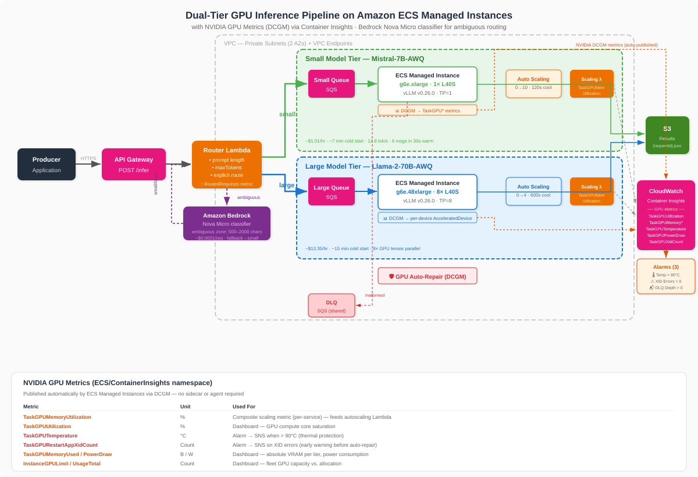

# ECS GPU Inference Pipeline

Production-ready, dual-tier GPU inference pipeline on Amazon ECS Managed Instances with intelligent request routing. An API Gateway endpoint accepts inference requests, a Router Lambda classifies complexity and routes to the appropriate tier — Mistral-7B on g6e.xlarge for simple requests, Llama-2-70B on g6e.48xlarge for complex ones. Both tiers scale independently from zero, recover automatically from GPU hardware failures, and write results to S3 — deployed with a single CloudFormation template.

## Architecture



```
                                    ┌─ Small SQS Queue ─→ ECS Service (g6e.xlarge, 1×L40S, Mistral-7B) ─┐
POST /infer → API Gateway → Router Lambda ─┤                                                                      ├─→ S3 Results
                                    └─ Large SQS Queue ─→ ECS Service (g6e.48xlarge, 8×L40S, Llama-70B) ─┘
                                                              ↓ (malformed)
                                                         Shared Dead Letter Queue
```

1. Producer sends a JSON request to `POST /infer` on the API Gateway endpoint
2. Router Lambda classifies by complexity (prompt length, maxTokens, or explicit `"route"` override) and enqueues to the appropriate SQS queue
3. ECS tasks on GPU Managed Instances long-poll their respective queue
4. SQS worker validates messages — malformed ones go to a shared DLQ
5. Valid requests are forwarded to the local vLLM server for inference
6. Results are written to S3 as `results/{requestId}.json`
7. Autoscaling adjusts each tier independently based on queue depth + GPU memory utilization

## Features

- **Intelligent routing** — Router Lambda classifies requests to the right-sized model tier
- **Scale-to-zero** — no GPU instances running when queues are empty
- **Independent scaling** — each tier has its own capacity provider, scaling metric, and alarms
- **GPU auto-repair** — ECS monitors NVIDIA GPU health via DCGM and auto-replaces impaired instances ([demo](demos/gpu-auto-repair/README.md))
- **Deployment circuit breaker** — automatically rolls back failed deployments on both services
- **Composite scaling metric** — `max(queueDepth/threshold, gpuUtilization/80)` per tier
- **Idempotent processing** — checks for existing results in S3 before running inference
- **Least-privilege IAM** — separate task roles per tier, scoped to specific buckets, queues, and namespaces
- **Enhanced Container Insights** — GPU utilization, memory, temperature, and power draw telemetry
- **Pre-built CloudWatch dashboard** — 4 sections: Routing, Small Tier, Large Tier, GPU Hardware

## Project Structure

```
├── infrastructure/
│   ├── template.yaml              # CloudFormation template (75 resources)
│   └── scaling_metric_lambda.py  # Composite scaling metric Lambda (queue depth + GPU utilization)
├── container/
│   ├── Dockerfile                 # vLLM v0.8.0 base + SQS worker
│   ├── entrypoint.sh              # Model download, vLLM startup, worker launch
│   ├── sqs_worker.py              # Queue polling, validation, inference forwarding
│   └── buildspec.yml              # CodeBuild spec for remote image builds
├── tests/
│   ├── conftest.py                # Shared pytest fixtures
│   ├── test_router_lambda.py      # Router Lambda routing logic
│   ├── test_sqs_worker_processing.py   # SQS worker end-to-end processing
│   ├── test_sqs_worker_validation.py   # Message schema validation
│   ├── test_sqs_long_polling.py        # Long-poll behavior
│   ├── test_valid_request_processing.py
│   ├── test_malformed_request_dlq_routing.py
│   ├── test_composite_scaling_metric.py
│   ├── test_model_s3_path_passthrough.py
│   ├── test_iam_least_privilege.py
│   ├── test_cross_references.py        # CloudFormation cross-resource reference checks
│   ├── test_integration.py             # End-to-end integration tests
│   ├── test_private_subnet_enforcement.py
│   ├── test_cost_allocation_tags.py
│   └── requirements.txt
├── demos/
│   └── gpu-auto-repair/           # XID fault-injection demo for ECS MI GPU auto repair
├── generated-diagrams/
│   └── ecs-gpu-inference-dual-tier.svg # Architecture diagram
├── CONTRIBUTING.md
├── CODE_OF_CONDUCT.md
└── LICENSE
```

## Prerequisites

- AWS CLI v2 (v2.32.0+)
- Docker 20.10+ with buildx support (or use CodeBuild for remote builds)
- EC2 GPU quota for g6e.xlarge and g6e.48xlarge in your target region
- A quantized model on S3, or use HuggingFace direct download (default — no upload needed)

## Quick Start

### 1. Set variables

```bash
export AWS_REGION=us-west-2
export STACK_NAME=ecs-gpu-inference
export MODEL_NAME=TheBloke/Mistral-7B-Instruct-v0.2-AWQ
export LARGE_MODEL_NAME=TheBloke/Llama-2-70B-Chat-AWQ
```

### 2. Deploy the stack

The template exceeds 51KB, so upload to S3 first:

```bash
aws s3 mb s3://${STACK_NAME}-cfn-templates-${AWS_REGION} --region $AWS_REGION
aws s3 cp infrastructure/template.yaml s3://${STACK_NAME}-cfn-templates-${AWS_REGION}/template.yaml

aws cloudformation create-stack \
  --stack-name $STACK_NAME \
  --template-url https://${STACK_NAME}-cfn-templates-${AWS_REGION}.s3.${AWS_REGION}.amazonaws.com/template.yaml \
  --parameters \
    ParameterKey=ModelS3Path,ParameterValue=s3://none/none/ \
    ParameterKey=ModelName,ParameterValue=$MODEL_NAME \
    ParameterKey=LargeModelS3Path,ParameterValue=s3://none/none/ \
    ParameterKey=LargeModelName,ParameterValue=$LARGE_MODEL_NAME \
  --capabilities CAPABILITY_NAMED_IAM \
  --region $AWS_REGION
```

> Use `s3://none/none/` for S3 paths when downloading models from HuggingFace. The entrypoint skips S3 download for this value.

### 3. Get stack outputs

```bash
API_URL=$(aws cloudformation describe-stacks --stack-name $STACK_NAME \
  --query 'Stacks[0].Outputs[?OutputKey==`InferenceApiUrl`].OutputValue' --output text)
ECR_URI=$(aws cloudformation describe-stacks --stack-name $STACK_NAME \
  --query 'Stacks[0].Outputs[?OutputKey==`ECRRepositoryUri`].OutputValue' --output text)
```

### 4. Build and push the container

Using CodeBuild (recommended — the vLLM image is ~8 GB):

```bash
cd container && zip -r /tmp/container-source.zip . && cd ..
aws s3 cp /tmp/container-source.zip s3://${STACK_NAME}-cfn-templates-${AWS_REGION}/container-source.zip
aws codebuild start-build --project-name ${STACK_NAME}-build --region $AWS_REGION
```

Or build locally:

```bash
aws ecr get-login-password --region $AWS_REGION | docker login --username AWS --password-stdin $ECR_URI
docker build --platform linux/amd64 -t $ECR_URI:v1.0.0 -t $ECR_URI:latest container/
docker push $ECR_URI:v1.0.0 && docker push $ECR_URI:latest
```

### 5. Create results bucket and update task role

```bash
aws s3 mb s3://${STACK_NAME}-results-${AWS_REGION} --region $AWS_REGION
aws iam put-role-policy --role-name ${STACK_NAME}-task-role \
  --policy-name OutputS3Access \
  --policy-document "{\"Version\":\"2012-10-17\",\"Statement\":[{\"Effect\":\"Allow\",\"Action\":[\"s3:PutObject\",\"s3:GetObject\",\"s3:HeadObject\"],\"Resource\":\"arn:aws:s3:::${STACK_NAME}-results-${AWS_REGION}/*\"}]}"
```

### 6. Send test requests

```bash
# Small tier (auto-routed)
curl -X POST $API_URL -H "Content-Type: application/json" \
  -d '{"requestId":"550e8400-e29b-41d4-a716-446655440000","prompt":"What is Amazon ECS?","maxTokens":128}'
# → {"requestId": "550e8400-...", "tier": "small"}

# Large tier (explicit route)
curl -X POST $API_URL -H "Content-Type: application/json" \
  -d '{"requestId":"550e8400-e29b-41d4-a716-446655440001","prompt":"Analyze this contract...","maxTokens":2048,"route":"large"}'
# → {"requestId": "550e8400-...", "tier": "large"}
```

### 7. Check results

```bash
aws s3 ls s3://${STACK_NAME}-results-${AWS_REGION}/results/
aws s3 cp s3://${STACK_NAME}-results-${AWS_REGION}/results/550e8400-e29b-41d4-a716-446655440000.json -
```

## Routing Logic

| Signal | Routes to | Rationale |
|---|---|---|
| `"route": "large"` in body | Large tier | Explicit override |
| `"route": "small"` in body | Small tier | Explicit override |
| Prompt > 2,000 characters | Large tier | Long context suggests complex reasoning |
| `maxTokens` > 1,024 | Large tier | Long-form generation benefits from 70B |
| Default | Small tier | Most requests are simple enough for 7B |

## CloudFormation Parameters

| Parameter | Default | Description |
|---|---|---|
| `ModelS3Path` | `none` | S3 URI for small model (use `s3://none/none/` for HuggingFace download) |
| `ModelName` | *(required)* | HuggingFace model identifier for small tier |
| `QuantizationMethod` | `awq` | Quantization method (`awq`, `gptq`, `none`) |
| `MaxSequenceLength` | `2048` | Max sequence length for small model |
| `MinTaskCount` | `0` | Min small-tier tasks (0 = scale-to-zero) |
| `MaxTaskCount` | `10` | Max small-tier tasks |
| `LargeModelS3Path` | `none` | S3 URI for large model |
| `LargeModelName` | *(required)* | HuggingFace model identifier for large tier |
| `LargeModelQuantization` | `awq` | Quantization for large model |
| `LargeModelMaxSequenceLength` | `4096` | Max sequence length for large model |
| `LargeModelMinTaskCount` | `0` | Min large-tier tasks |
| `LargeModelMaxTaskCount` | `4` | Max large-tier tasks |
| `LargeModelGPUCount` | `8` | GPUs per large-tier task |
| `PromptComplexityThreshold` | `2000` | Prompt char length threshold for large routing |
| `MaxTokensComplexityThreshold` | `1024` | maxTokens threshold for large routing |
| `QueueDepthScaleThreshold` | `5` | Queue depth for scaling metric |
| `ScaleDownCooldownSeconds` | `300` | Cooldown before scaling down |
| `LogRetentionDays` | `30` | CloudWatch log retention |
| `OutputDestination` | `""` | S3 URI or SQS URL for results |
| `CostAllocationTagProject` | `gpu-inference-pipeline` | Cost allocation tag |

## Infrastructure Provisioned (75 resources)

- **Networking** — VPC, public/private subnets (2 AZs), NAT Gateway, VPC Endpoints (S3, SQS, ECR, CloudWatch Logs)
- **Ingestion** — API Gateway HTTP API (`POST /infer`), Router Lambda with SQS + CloudWatch permissions
- **Queues** — Small request queue, large request queue, shared DLQ
- **Compute** — ECS cluster with 2 Managed Instances capacity providers:
  - Small: g6e.xlarge/2xlarge (1× L40S, 48 GB VRAM)
  - Large: g6e.48xlarge (8× L40S, 384 GB VRAM)
- **Services** — 2 ECS services with independent desired counts and deployment circuit breakers
- **Container registry** — ECR repository with lifecycle policy
- **IAM** — Task execution role, small task role, large task role, router role, infrastructure role, instance profile
- **Autoscaling** — 2 Lambda-based composite metrics, 2 sets of step scaling policies and alarms
- **Observability** — 3 log groups, dashboard (4 sections), GPU temperature alarm, GPU XID alarm, DLQ alarm, SNS topic, container-instance health EventBridge rule (GPU auto-repair events → Logs + SNS)

## GPU Auto-Repair

Both capacity providers enable ECS Managed Instances GPU auto repair
(`autoRepairConfiguration.actionsStatus = ENABLED`). ECS uses NVIDIA DCGM to monitor GPU health;
when DCGM reports a critical XID, ECS marks the container instance `IMPAIRED`
(`ACCELERATED_COMPUTE` health check, `statusReason` `XID_<n>`) and replaces it with a
start-before-stop workflow — provisioning a healthy instance before draining and terminating the
faulted one, so capacity is never lost. The stack also ships an EventBridge rule that records
these health-change events to CloudWatch Logs and the SNS alarm topic.

To see it end-to-end without waiting for real hardware to fail, the
[`demos/gpu-auto-repair/`](demos/gpu-auto-repair/README.md) demo injects a synthetic NVIDIA XID
into the host DCGM engine from an ECS task. Verified on a live g6e.xlarge (L40S) cluster:

| Stage | Timing |
|---|---|
| Inject `XID 79` → ECS marks instance `IMPAIRED` (`XID_79`) | ~2 minutes |
| `IMPAIRED` → drain + replacement provisioned + faulted instance terminated | ~8 minutes |

See the [demo README](demos/gpu-auto-repair/README.md) for the injection method, the socket-mount
detail specific to Managed Instances, and step-by-step verification.

## Observed Performance (Small Tier — Mistral-7B-AWQ on g6e.xlarge)

| Metric | Value |
|---|---|
| Cold start (end-to-end) | ~7 minutes |
| Inference latency | ~5 seconds (128 max tokens) |
| Throughput (warm) | 6 messages in ~30 seconds |
| Token generation rate | ~12.8 tokens/s |
| Scale-out trigger to alarm | ~2 minutes |

## Request / Response Format

**Request:**
```json
{
  "requestId": "uuid-v4",
  "prompt": "Your prompt text",
  "maxTokens": 256,
  "temperature": 0.7,
  "route": "small"
}
```

**Response (S3):**
```json
{
  "requestId": "uuid-v4",
  "status": "success",
  "result": {
    "text": "Generated text...",
    "usage": {"promptTokens": 17, "completionTokens": 102, "totalTokens": 119},
    "finishReason": "stop"
  },
  "processingTimeMs": 4956,
  "timestamp": "2026-05-03T04:35:47.906601+00:00"
}
```

## Running Tests

```bash
pip install -r tests/requirements.txt
pytest tests/ -v
```

## Cost Considerations

| | Small Tier | Large Tier |
|---|---|---|
| Instance | g6e.xlarge (~$1.01/hr) | g6e.48xlarge (~$13.35/hr) |
| GPUs | 1× L40S (48 GB) | 8× L40S (384 GB) |
| Scale-in cooldown | 300s | 600s |
| Scale-in eval periods | 5 | 10 |

- **Scale-to-zero** on both tiers — no GPU costs when queues are empty
- **Routing saves 60-80%** — most requests handled by the cheap small tier
- **Zero control-plane fees** — unlike EKS ($0.10/hr per cluster)
- **Compute Savings Plans** — up to 37% reduction for steady-state workloads

## Cleanup

```bash
aws s3 rm s3://${STACK_NAME}-results-${AWS_REGION} --recursive
aws s3 rb s3://${STACK_NAME}-results-${AWS_REGION}
aws s3 rb s3://${STACK_NAME}-cfn-templates-${AWS_REGION} --force
aws cloudformation delete-stack --stack-name $STACK_NAME --region $AWS_REGION
```

Managed Instances are fully cleaned up when the capacity provider is deleted — no orphaned ASGs or launch templates.

> If you ran the [GPU auto-repair demo](demos/gpu-auto-repair/README.md), also remove its leftovers
> (the EventBridge rule and health log group are part of the stack and go with it):
> ```bash
> aws logs delete-log-group --log-group-name /ecs/xid-inject --region $AWS_REGION
> aws iam delete-role-policy --role-name ${STACK_NAME}-task-role --policy-name EcsExecForXidInject
> ```

## License

See [LICENSE](LICENSE) for details.
